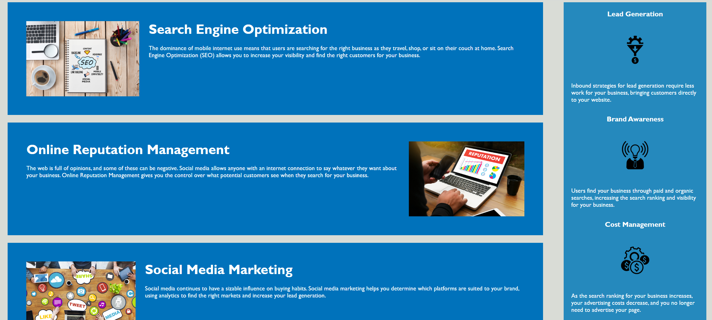

# <Horiseon  Homework task>

## Description

The purpose of this project was to refactor the code of the Horiseon website so that it is more accessible. Alt-text was added to images, and the code was consolidated, re-ordered more logically and streamlined where possible.

I learned the value of using a single CSS selector to target multiple elements to achieve readability and simplicity, rather than having the same code appear multiple times.

## Installation

The project can be accessed at https://niktern.github.io/Refactoring-Horiseon-Webpage/

## Usage

Screenshot of unfactored website:

Screenshots of refactored website:

## Credits

All images and code was already built and provided by Horiseon

## License

MIT License

Copyright (c) [2022] [NikolasTernezis]

Permission is hereby granted, free of charge, to any person obtaining a copy
of this software and associated documentation files (the "Software"), to deal
in the Software without restriction, including without limitation the rights
to use, copy, modify, merge, publish, distribute, sublicense, and/or sell
copies of the Software, and to permit persons to whom the Software is
furnished to do so, subject to the following conditions:

The above copyright notice and this permission notice shall be included in all
copies or substantial portions of the Software.

THE SOFTWARE IS PROVIDED "AS IS", WITHOUT WARRANTY OF ANY KIND, EXPRESS OR
IMPLIED, INCLUDING BUT NOT LIMITED TO THE WARRANTIES OF MERCHANTABILITY,
FITNESS FOR A PARTICULAR PURPOSE AND NONINFRINGEMENT. IN NO EVENT SHALL THE
AUTHORS OR COPYRIGHT HOLDERS BE LIABLE FOR ANY CLAIM, DAMAGES OR OTHER
LIABILITY, WHETHER IN AN ACTION OF CONTRACT, TORT OR OTHERWISE, ARISING FROM,
OUT OF OR IN CONNECTION WITH THE SOFTWARE OR THE USE OR OTHER DEALINGS IN THE
SOFTWARE.